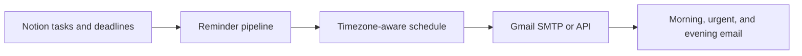

# Notion Study Reminders

[](https://github.com/kofdarelli/notion-reminder/actions/workflows/ci.yml)
[](package.json)
[](LICENSE)

Turn a Notion study schedule into timezone-safe email digests and urgent deadline reminders—automatically and free with GitHub Actions.



## Why use it?

- **Morning and evening digests** summarize unchecked study tasks and active deadlines.
- **Urgent alerts** call out overdue work and deadlines approaching within a configurable window.
- **Timezone-safe scheduling** evaluates the run in code, so Beirut daylight-saving changes do not shift delivery times.
- **Two Gmail options** support either an app password through SMTP or OAuth through the Gmail API.
- **Read-only Notion access** retrieves content without modifying your workspace.
- **No application server** is required; the included GitHub Actions workflow runs hourly and sends only at configured times.

By default, digests run at 07:00 and 20:00 and urgent checks run at 13:00 in `Asia/Beirut`.

## Quick start

The project requires Node.js 18 or newer and has no third-party runtime dependencies.

```bash
git clone https://github.com/kofdarelli/notion-reminder.git
cd notion-reminder
npm test
cp .env.example .env
```

Create a Notion integration, share the study page and database with it, then add at minimum:

```env
NOTION_TOKEN=secret_...
NOTION_PAGE_ID=...
NOTION_DATABASE_ID=...
RECIPIENT_EMAIL=you@example.com

EMAIL_PROVIDER=smtp
SMTP_USER=you@gmail.com
SMTP_APP_PASSWORD=your_app_password
```

Run a digest locally:

```bash
npm run digest
```

Other commands:

```bash
npm run urgent     # Send only when urgent work exists
npm run auto       # Select the correct mode for the current time
npm run gmail-auth # Create a Gmail API refresh token
```

## Notion setup

1. Create a Notion integration and keep its token private.
2. Share the study scheduler page and study schedule database with the integration.
3. Set `NOTION_PAGE_ID` and either `NOTION_DATABASE_ID` or `NOTION_DATA_SOURCE_ID`.
4. Confirm that checklist tasks are unchecked until complete and deadline records use a real Notion date property.

The service reads unchecked checklist items from the page and active deadline items from the database. Database dates remain the source of truth for deadline classification.

## Email providers

### Gmail SMTP

This is the shortest setup when Gmail app passwords are available:

1. Enable Google 2-Step Verification.
2. Create an app password for Mail.
3. Set `EMAIL_PROVIDER=smtp`, `SMTP_USER`, and `SMTP_APP_PASSWORD`.

The default connection uses `smtp.gmail.com`, port `465`, with TLS.

### Gmail API

Use OAuth refresh tokens instead of an SMTP app password:

1. Create or select a project in [Google Cloud Console](https://console.cloud.google.com/).
2. Enable the Gmail API.
3. Create OAuth credentials for a desktop application.
4. Set `GMAIL_CLIENT_ID`, `GMAIL_CLIENT_SECRET`, and `GMAIL_SENDER_EMAIL` in `.env`.
5. Run `npm run gmail-auth`, open the printed URL, and approve Gmail send access.
6. Save the printed `GMAIL_REFRESH_TOKEN` in `.env`.

The default local OAuth callback is `http://127.0.0.1:53682/oauth2callback`.

## GitHub Actions

The scheduled workflow runs at minute 7 of every hour. The application then checks the configured timezone and decides whether the current run is a digest, urgent check, or no-op. This avoids hard-coding daylight-saving offsets into cron expressions.

Add these required repository secrets:

- `NOTION_TOKEN`
- `RECIPIENT_EMAIL`
- `NOTION_PAGE_ID`
- either `NOTION_DATABASE_ID` or `NOTION_DATA_SOURCE_ID`

For SMTP, also add `SMTP_USER` and `SMTP_APP_PASSWORD`. For the Gmail API, add `GMAIL_CLIENT_ID`, `GMAIL_CLIENT_SECRET`, `GMAIL_REFRESH_TOKEN`, and `GMAIL_SENDER_EMAIL`.

Configuration such as `TIME_ZONE`, `DEADLINE_WINDOW_DAYS`, `DIGEST_HOURS`, `URGENT_HOUR`, `EMAIL_PROVIDER`, and Gmail connection settings may be stored as repository variables or secrets.

## Configuration reference

| Variable | Default | Purpose |
| --- | --- | --- |
| `NOTION_API_VERSION` | API default | Optional Notion API version override |
| `NOTION_PAGE_ID` | — | Study scheduler page ID |
| `NOTION_DATABASE_ID` | — | Deadline database ID |
| `NOTION_DATA_SOURCE_ID` | — | Alternative to `NOTION_DATABASE_ID` |
| `TIME_ZONE` | `Asia/Beirut` | IANA timezone used for scheduling |
| `DEADLINE_WINDOW_DAYS` | `7` | Number of days considered approaching |
| `DIGEST_HOURS` | `7,20` | Local hours for full digests |
| `URGENT_HOUR` | `13` | Local hour for urgent-only reminders |
| `EMAIL_PROVIDER` | `smtp` | `smtp` or `gmail-api` |
| `SMTP_HOST` | `smtp.gmail.com` | SMTP hostname |
| `SMTP_PORT` | `465` | SMTP port |
| `SMTP_SECURITY` | `tls` | SMTP transport security |
| `GMAIL_REDIRECT_URI` | local callback | OAuth callback URL |

See [.env.example](.env.example) for the complete list.

## Behavior

- Digest emails send a short all-clear when nothing is pending.
- Urgent runs send nothing when no work is overdue or approaching.
- Secrets are never written to logs by the application.
- The reminder workflow has read-only repository permissions.

## Contributing and security

Focused improvements are welcome. Read [CONTRIBUTING.md](CONTRIBUTING.md) before opening a pull request and report vulnerabilities privately using [SECURITY.md](SECURITY.md).

Licensed under the [MIT License](LICENSE).
